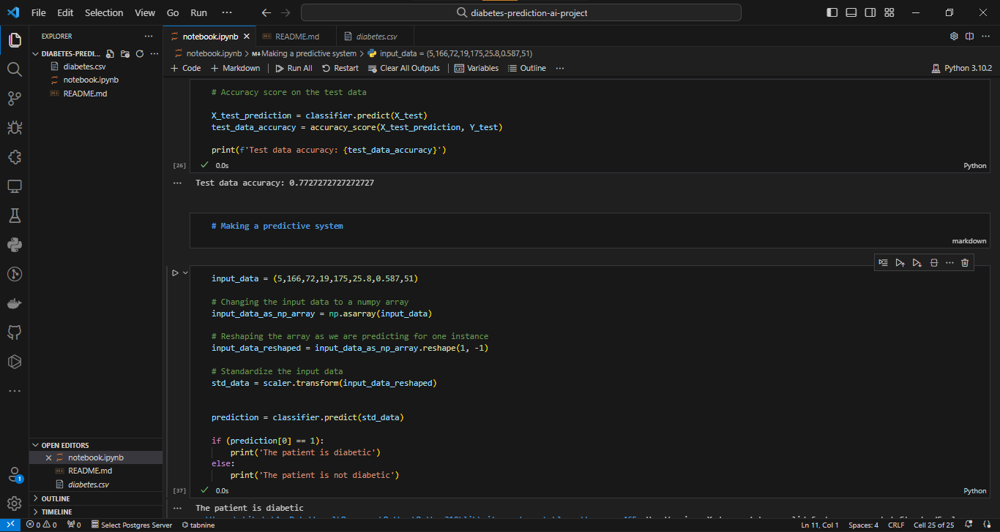

# Diabetes prediction model using SVM

I implemented a diabetes prediction model using a Support Vector Model that analyses the Pregnancies, Glucose, Blood pressure, Skin thickness, Insulin, BMI, Diabetes Pedigree Function and Age of a patient to determine whether they have diabetes or not.

The model had an accuracy score of 0.7727 on the test data.

